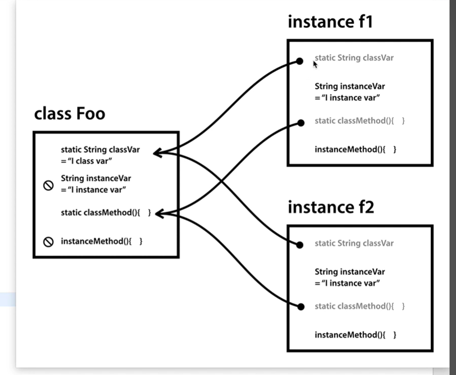

# 객체 지향
- 메서드(함수) 만으로 프로그래밍의 한계가 도달함
- 단순한 정의와 함수 만으로도 효율적인 코딩에 도달할 수 있다
## class import 하기
- public class 는 java 파일 당 한번만 등장해야 한다
- 이후 build가 진행되면서 class 파일이 하나 생성된다
## instance
- 기존의 방식은 클래스를 직접 가져와서 print라는 class 안에 직접 변수를 부여하엿다
- 하지만, 이번에는 복제한 클래스를 가져와서 쉽게 반복할 수 있다
- 이를 우리는 인스턴스 라고 부른다
- Print p1 = new Print();
- 이 인스턴스는 자신만의 별개의 변수를 가지게 된다
- 참고로 이 형식으로 변환 시 public static 에서 static을 제거해 줘야 한다

### static
- 앞서 공부했듯이 인스턴스화 시켰을 때 활용할 수 있는 지의 여부를 결정해 주는 것이다 (참조 가능 범위 제한)
- 인스턴스 일 경우에는 static이 없어도 있어도 다 됨
- 반대로 static은 인스턴스 일 때 접근이 안됨 (기존 클래스 것을 참고하고 있다)
- 즉, class의 static은 전체 다 변화를 겪음
- 반대로 class 일때는 인스턴스 변수에는 접근이 안됨
- 좀 복잡한데 이해한게 맞다
- 즉, 독립되냐 안되냐 + 접근되냐 안되냐

### 생성자와 this
- class가 인스턴스화 될때 자신의 이름과 동일한 메서드가 존재하면
- 생성자로써 역할하게 한다
- 이를 통해 인스턴스 변수에 할당할 수 있다
- 또한, 더 쉽게 this를 붙여서 동일한 이름으로 할당 되도록 유도할 수 있다
- 이것이 더욱 정확한 표현이다